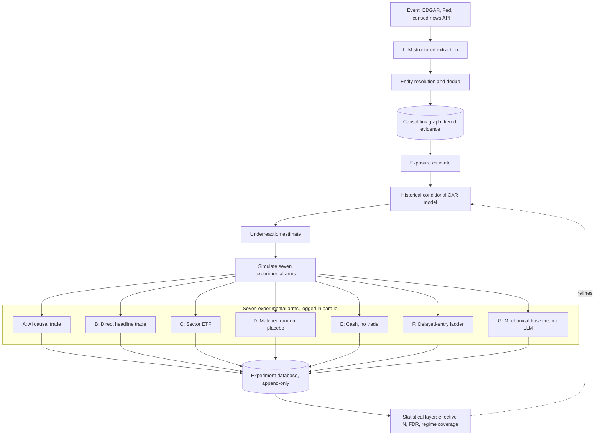

# The Diffusion Experiment — Version 2 Specification

*A buildable Phase I blueprint merging the original system design, "The Underreaction Audit" (an adversarial review), and two rounds of independent cross-review with a second AI.*

**Drafted:** 30 August 2026
**Phase I scope:** research only — no autonomous money, no options, no crypto, no leverage

> **The mandate:** does *new event → economic linkage → measurable underreaction → predictable residual return* exist strongly enough to survive trading costs — and does an LLM add anything a much simpler mechanical model doesn't already capture? Phase I exists to answer those two questions and nothing else.

---

## 0. What Phase I is, and what it deliberately is not

Phase I is an information-diffusion research system that happens to log hypothetical portfolios, not a trading bot that happens to keep records. Concretely: no autonomous money, no human-confirmed real trades either, no options, no crypto, no leverage, and no ingestion from WSJ, FT, or The Economist until the licensing question is separately resolved. It has: real-time structured extraction from free, API-native, unambiguously licensed sources; a citation-grounded causal-link graph; a formal (if initially crude) underreaction estimate; seven parallel hypothetical portfolios per qualifying event; and a database built to answer, honestly, whether any of this has predictive value before a single dollar is at risk.

---

## 1. Event schema

The LLM's job is structured economic extraction, not sentiment scoring. No field below is a number the LLM is trusted to have calibrated — every number is either a raw candidate feature (logged, not trusted) or the output of the separate statistical layer in Section 3.

```
EVENT
  id, timestamp, first_disclosure_timestamp, source, source_tier
  event_category   (e.g. guidance_raise, capacity_expansion, supply_agreement)
  direct_entity    (ticker of the company the event is directly about)

ECONOMIC VARIABLES  (structured, not prose)
  e.g. gpu_shipments: up | hbm_demand: up | advanced_packaging_demand: up

CAUSAL LINKS  (one row per proposed affected entity — see Section 2 for tiers)
  entity, relationship_type (supplier | customer | competitor | infrastructure)
  evidence_tier, evidence_citation (specific document + sentence)
  p_relationship_exists, p_shock_transmits

EXPOSURE  (per linked entity)
  relationship_confidence, revenue_dependence, time_horizon, geographic_exposure

MARKET OBSERVATION  (from the independent market-data feed, not the LLM)
  current_CAR_direct_entity, current_CAR_per_linked_entity
  abnormal_volume_z per entity

HISTORICAL MODEL  (from Section 3 — not asserted by the LLM)
  conditional_expected_CAR | event_characteristics
  uncertainty_interval

DERIVED
  expected_residual_return = conditional_expected_CAR − current_CAR
  novelty_class  (embedding + entity/fact-hash dedup, timestamped to first
                   disclosure, log-decayed by repetition count)

VERSIONING
  extraction_model_version, prompt_version, scoring_model_version
```

**Worked example** (illustrative): a chipmaker raises forward shipment guidance citing accelerator demand. The direct entity jumps immediately. Extraction identifies a Tier B (named-partner) HBM supplier and a Tier A (SEC-disclosed, >10% revenue concentration) packaging/foundry partner, estimates each one's exposure, and checks the market: the direct entity is already up several points, one linked name has moved only marginally, the other not at all. The historical model, built from comparable past shocks to similarly tiered, similarly exposed names, estimates a conditional expected reaction with an uncertainty band; the gap between that estimate and the current, nearly-flat move is the expected residual return the seven arms in Section 4 test.

---

## 2. Causal-link evidence tiers

No causal link is asserted from general model knowledge alone, and no single evidentiary bar applies to every link — a bar strong enough to stop hallucination would also filter out the newest, least-yet-disclosed relationships the system exists to catch. Two probabilities are tracked separately per link: whether the relationship exists at all, and whether a given shock actually transmits through it. A brand-new, real relationship can have high `p_relationship_exists` and a wide-uncertainty `p_shock_transmits` at the same time — that's a real signal, not noise.

| Tier | Evidence | Treatment |
|---|---|---|
| **A** | SEC-required disclosure (Item 101/ASC 280, >10% revenue customer), Fed data, or other primary regulatory filing | Highest eligibility/sizing ceiling once statistically validated |
| **B** | Named partner on an earnings call or press release; company-furnished transcript/8-K exhibit | Middle tier — home for real but freshly formed relationships with no disclosure history yet |
| **C** | Analyst inference, general model knowledge, or a commercially licensed third-party dataset | Logged for research value only; never eligible to size a position or count toward the primary hypothesis until independently corroborated |

Historical price co-movement is logged as corroboration where it exists, but its absence is never disconfirming — that's the expected state of anything genuinely new.

---

## 3. The underreaction estimator

```
UR_i  =  E( CAR[0,H] | X_i )  −  CAR[0, t]

where:
  CAR[0, t]        = cumulative abnormal return realized so far, from a factor-model
                      regression estimated on a clean pre-event window (~250 to 30
                      trading days back)
  E(CAR[0,H] | X_i) = expected eventual reaction, conditional on event characteristics
                      X_i, estimated from HISTORICAL COMPARABLE EVENTS — never from
                      this event's own future, which doesn't exist yet at decision time
  X_i              = {event_category, surprise_magnitude, evidence_tier,
                       relationship_type, historical_beta_to_primary, liquidity,
                       sector, volatility_regime}
  H                = the horizon being evaluated (see Section 4, arm F)
```

Two rules matter more than the equation: `E(CAR|X)` starts crude (a grouped historical average with a wide uncertainty interval) and only refines as data accumulates — it's not a place to over-fit on day one. And abnormal volume is a feature inside `X_i`, never a binary override: high volume is ambiguous between completed price discovery and ongoing disagreement.

---

## 4. Seven experimental arms

Every qualifying signal spawns seven simultaneous hypothetical portfolios, logged identically regardless of outcome.

| Arm | Action | What it isolates |
|---|---|---|
| **A** — AI causal trade | Buy the second-order security the causal-link graph and underreaction estimate selected | The system's actual proposal |
| **B** — Obvious trade | Buy the directly affected, headline company instead | Whether second-order reasoning beats simply chasing the headline |
| **C** — Sector trade | Buy the corresponding sector ETF | Whether any edge is really just sector beta |
| **D** — Placebo | Buy a matched random security, same sector/liquidity band | Whether news-driven selection adds anything beyond generic exposure |
| **E** — Cash | No trade | The floor everything else has to clear |
| **F** — Delayed-entry ladder | Same arm-A trade entered immediately, +30 min, +2 hr, next-day open | A signal-decay curve α(t) — how much speed matters, and whether this is a fast-decaying edge already claimed by faster institutions or a genuinely slow-diffusing one |
| **G** — Mechanical baseline | A simple, LLM-free model: event category, direct return, sector, historical correlation, volume, volatility | The single most important comparison: does the LLM's causal reasoning add anything over a cheap statistical baseline? |

Arm G should be pre-registered as a primary comparison, not an afterthought — the project's central claim only survives if arm A beats arm G by a margin clearing the statistical bar in Section 7, net of the LLM pipeline's own cost and latency.



---

## 5. Phase I data sources

| Tier | Source | Role |
|---|---|---|
| Government/regulatory | SEC EDGAR (REST/JSON, XBRL, filing RSS), Federal Reserve (FRED, release calendar) | System of record; free, explicitly machine-licensed |
| Company-originated | IR releases, company-furnished transcripts (8-K exhibits) | Tier-B evidence for causal links; low licensing risk |
| Licensed algorithmic feed | One API-native news product (Benzinga, Polygon.io news) — paid, not scraped | Trigger layer, in place of WSJ/FT/Economist until licensing is cleared |
| Independent market data | Polygon.io, Alpaca, or Tiingo | Price/volume/factor data for the event-study engine, decoupled from execution |

WSJ, FT, and The Economist are deliberately absent from Phase I — nothing in the mandate requires them yet, and building the trigger layer on already-resolved licensing avoids ripping it out later.

---

## 6. Database & schema

Postgres is sufficient — low-volume, high-value-per-row, not a big-data problem. Non-negotiable: append-only and immutable; corrections are new, superseding versions with explicit lineage, never in-place edits.

| Table | Holds |
|---|---|
| `raw_documents` | Source, URL/ID, fetch timestamp, first-known public-disclosure timestamp, content hash |
| `entity_relationships` | Versioned causal-link graph: tier, citation, p_relationship_exists, p_shock_transmits |
| `extracted_events` | Full Section 1 schema per event, with extraction/prompt version |
| `underreaction_estimates` | X_i features, E(CAR\|X), CAR observed, uncertainty interval, scoring-model version |
| `experiment_arms` | One row per arm (A–G) per signal: hypothetical entry, fills, return at each horizon (30min/1hr/1day/5day/20day), MFE/MAE |
| `market_data` | Point-in-time OHLCV, volume, factor exposures |
| `regime_tags` | Time-indexed volatility/rate regime label, joined against every signal |

Version every model/config that can change (extraction model + prompt, scoring model, risk-limit config) so every row is reproducible and attributable to the exact pipeline state that produced it.

---

## 7. Statistical framework

- **Effective sample size, not raw count or calendar time.** Correlated signals sharing one catalyst discount toward one effective observation; a formal power analysis (once real data exists) determines how many effective, independent signals are needed to distinguish arm A vs. arm G from zero at a defensible confidence level.
- **Regime coverage is separate and non-substitutable.** No volume of same-regime data answers whether the effect survives a regime change — satisfied by elapsed calendar time and observed regime variety, not sample size alone.
- **Pre-registration.** One primary hypothesis (arm A beats arm G, net of costs, by a pre-specified margin) fixed before data collection; every "performance by X" breakdown is exploratory by default.
- **Multiple-testing correction.** FDR correction across the full grid of comparisons examined; a hierarchical/partial-pooling model shrinks sparse categories toward the grand mean.
- **Costs in the primary metric, taxes not.** Every arm's return is net of spread/slippage/impact from the outset; tax treatment is a separate, later, account-specific overlay.

---

## 8. Promotion gates

| Transition | Gate |
|---|---|
| Build → running Phase I | Low hallucination rate on hand-reviewed causal links; working novelty dedup; clean point-in-time database; all seven arms logging correctly on live data |
| Phase I → human-confirmed real trades | Effective, correlation-adjusted sample size in the low hundreds; arm A beats arm G net of costs by a pre-specified margin with a CI excluding zero at a multiple-testing-adjusted bar; observation across ≥2 distinct regimes; no single trade/category driving the result |
| Human-confirmed → limited autonomous | 50–100 human-confirmed trades consistent with the Phase I distribution; no unresolved system failures, risk-limit breaches, or prompt-injection incidents; written post-mortem for every large loss; account type confirmed directly with Robinhood, not assumed |
| Capital scale-up | Continued positive out-of-sample expectancy on a genuinely new period; drawdown inside a pre-committed budget; incremental increases, each re-confirming the edge |

---

## 9. Phase I tech stack

| Layer | Recommendation |
|---|---|
| Pipeline language | Python |
| Extraction | Any current-generation LLM API, versioned prompt, structured-output mode matching the Section 1 schema exactly |
| Deduplication/novelty | Embedding similarity (Postgres + `pgvector` is enough at this scale) plus a structured entity/fact hash as the sharper second pass |
| Database | Postgres — append-only tables per Section 6 |
| Market data | Polygon.io, Alpaca, or Tiingo |
| Scheduling/ingestion | A worker process polling EDGAR RSS, the Fed calendar, and the licensed news API on independent schedules |
| Monitoring/weekly review | A lightweight dashboard (a scheduled notebook or small Streamlit app) for the standing human hallucination-check and arm-by-arm return distributions |

---

## 10. Guardrails built in from day one

Phase I doesn't trade, but the boundary between reasoning and authority should exist from the first line of code, not get retrofitted before Phase II. The LLM has no write access to its own configuration, prompt version, or (once they exist) risk parameters. External content is structurally treated as data to analyze, never as instructions, in every prompt. Every table in Section 6 is append-only so no component — including a compromised or malfunctioning one — can quietly rewrite history.

---

## 11. Open items before Phase II

- Read the actual current WSJ, FT, and Economist terms of service before any re-enters the pipeline as a source.
- Confirm directly which Robinhood account type the Agentic account will be — a cash account (consistent with "no leverage") carries T+1 settlement and good-faith/free-riding constraints; a margin account is no longer subject to pattern-day-trading rules as of Robinhood's June 2026 change, but reintroduces leverage this design otherwise avoids. Don't assume either without checking.
- Get the current LLM API provider's usage terms around automated financial decision-making, and re-verify Robinhood's Trading MCP capabilities close to the Phase II build date — both have changed materially within the life of this review already.
- Wash-sale exposure from rapid re-entry, and a tax professional's review of the short-holding-period, ordinary-income-heavy activity this design generates once real trading starts.

---

## 12. Provenance

This specification merges the original system design, "The Underreaction Audit," and two rounds of independent critique from a second AI, each checked against evidence rather than accepted or dismissed on authority — including, in both directions, catching and correcting factual claims about a fast-moving Robinhood beta product that changed mid-review. Arms F and G, the two-probability evidence model, and the engineering/alpha-durability and engineering/capital-scalability distinctions elsewhere in this review series originated in the second round of critique and are adopted here because they held up, not by default.
